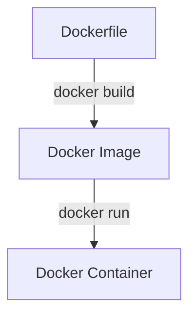
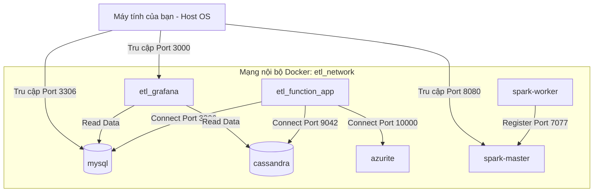

# Hướng dẫn chi tiết: Docker, Dockerfile và Docker Compose trong Dự án ETL

Tài liệu này được viết nhằm giải thích chi tiết, dễ hiểu nhất về bản chất của **Docker**, **Dockerfile**, **Docker Compose** và cách chúng hoạt động cùng nhau trong dự án ETL Pipeline của bạn.

---

## 1. Bản chất của Docker: Container và Image là gì?

Để hiểu Docker, hãy tưởng tượng bạn muốn vận chuyển hàng hóa đi khắp thế giới. Trước đây, mỗi loại hàng hóa (than, gạo, xe máy) cần một loại tàu và cách xếp dỡ riêng. Từ khi **Container** tiêu chuẩn hóa ra đời, mọi thứ đều được đóng vào thùng container chuẩn và bất kỳ tàu chở container nào cũng chở được.

**Docker hoạt động y như vậy trong phần mềm:**
*   **Ứng dụng của bạn:** Là hàng hóa (Python, Java, Spark, SQL, thư viện đi kèm...).
*   **Docker Container:** Là thùng container tiêu chuẩn đóng gói toàn bộ ứng dụng và môi trường chạy của nó.
*   **Docker Engine (Runtime):** Là chiếc tàu chở container, giúp chạy ứng dụng của bạn trên bất kỳ máy tính nào (Windows, macOS, Linux) mà không lo bị lỗi "chạy trên máy tôi được nhưng máy khác lỗi".

### Sự khác biệt cốt lõi giữa Máy ảo (VM) và Docker Container

| Đặc điểm | Máy ảo (Virtual Machine - VM) | Docker Container |
| :--- | :--- | :--- |
| **Hệ điều hành (OS)** | Mỗi VM chứa 1 OS đầy đủ (nặng vài GB). | Dùng chung Kernel của OS máy chủ (cực kỳ nhẹ, chỉ vài MB đến vài trăm MB). |
| **Hiệu năng & Tốc độ**| Khởi động lâu (vài phút), tốn nhiều RAM/CPU cho OS ảo. | Khởi động trong tích tắc (vài mili-giây), hiệu năng gần như máy thật. |
| **Độ cô lập** | Cô lập hoàn toàn ở mức phần cứng. | Cô lập ở mức tiến trình (Process) nhờ các tính năng của Linux Kernel. |

### Hai khái niệm bắt buộc phải phân biệt:
1.  **Docker Image (Ảnh mẫu):** Là một file tĩnh chứa mã nguồn, thư viện, biến môi trường và cấu hình hệ thống. Nó giống như **bản thiết kế ngôi nhà** hoặc **đĩa cài đặt game**. Image chỉ đọc (read-only) và không thể chạy trực tiếp.
2.  **Docker Container (Thùng chứa):** Là một thực thể hoạt động được tạo ra từ Docker Image. Nó giống như **ngôi nhà được xây từ bản thiết kế** hoặc **game đang được mở lên chơi**. Bạn có thể chạy, dừng, xóa, hoặc tạo nhiều Container từ cùng một Image.

---

## 2. Dockerfile là gì? Giải thích Dockerfile của bạn

### Bản chất của Dockerfile
**Dockerfile** là một file text không có đuôi mở rộng, chứa một chuỗi các chỉ thị (lệnh) xếp chồng lên nhau theo thứ tự từ trên xuống dưới để **hướng dẫn Docker tự động đóng gói (build) ra một Docker Image**.

Mỗi dòng lệnh trong Dockerfile tạo ra một **Layer (lớp)** trong Image. Docker sẽ cache các layer này để việc build lần sau nhanh hơn.



---

### Giải thích chi tiết từng dòng trong `Dockerfile` của bạn:

Dưới đây là nội dung Dockerfile hiện tại trong dự án của bạn và ý nghĩa thực tế của nó:

```dockerfile
# 1. Định nghĩa Base Image (Lớp nền)
FROM mcr.microsoft.com/azure-functions/python:4-python3.10

# 2. Cài đặt thêm Java JRE để chạy được PySpark
RUN apt-get update && \
    apt-get install -y default-jre && \
    apt-get clean && \
    rm -rf /var/lib/apt/lists/*

# 3. Thiết lập các biến môi trường cho Azure Functions
ENV AzureWebJobsScriptRoot=/home/site/wwwroot \
    AzureWebJobsFeatureFlags=EnableWorkerIndexing

# 4. Sao chép toàn bộ mã nguồn từ máy bạn vào container
COPY . /home/site/wwwroot

# 5. Đổi tên/sao chép file chạy chính để Azure Functions nhận diện
RUN cp /home/site/wwwroot/etl_pipeline.py /home/site/wwwroot/function_app.py

# 6. Cài đặt các thư viện Python cần thiết
RUN cd /home/site/wwwroot && \
    pip install -r requirements.txt
```

#### Giải thích chi tiết:

*   **`FROM mcr.microsoft.com/azure-functions/python:4-python3.10`**
    *   *Ý nghĩa:* Docker không tự build mọi thứ từ đầu. Chỉ thị `FROM` lấy một Image nền có sẵn trên mạng (được Microsoft build sẵn cho Azure Functions chạy Python 3.10) làm gốc.
*   **`RUN apt-get update && apt-get install -y default-jre ...`**
    *   *Ý nghĩa:* Vì dự án của bạn sử dụng **PySpark** để xử lý dữ liệu lớn, mà PySpark lại chạy trên nền Java Virtual Machine (JVM), do đó container cần có Java. Lệnh `RUN` này thực hiện cập nhật package manager của hệ điều hành Linux trong container, cài đặt Java JRE (`default-jre`), sau đó dọn dẹp bộ nhớ đệm (`apt-get clean`) để dung lượng Image nhẹ nhất có thể.
*   **`ENV AzureWebJobsScriptRoot=...`**
    *   *Ý nghĩa:* Thiết lập các biến môi trường (`ENV`) trong container. Các biến này giúp Azure Functions Runtime biết thư mục gốc chứa code ở đâu và kích hoạt tính năng cần thiết.
*   **`COPY . /home/site/wwwroot`**
    *   *Ý nghĩa:* Sao chép toàn bộ file và thư mục từ thư mục hiện tại trên máy bạn (dấu `.`) vào trong đường dẫn `/home/site/wwwroot` bên trong Container.
*   **`RUN cp /home/site/wwwroot/etl_pipeline.py /home/site/wwwroot/function_app.py`**
    *   *Ý nghĩa:* Sao chép file code ETL chính của bạn thành file `function_app.py`. Azure Functions (mô hình lập trình mới v2) mặc định tìm file `function_app.py` làm điểm bắt đầu (Entry point) để chạy.
*   **`RUN cd /home/site/wwwroot && pip install -r requirements.txt`**
    *   *Ý nghĩa:* Di chuyển vào thư mục code và cài đặt các thư viện Python (như `pyspark`, `azure-functions`) được định nghĩa trong file `requirements.txt` bằng công cụ `pip`.

> [!NOTE]
> **Tóm lại:** Dockerfile này giúp bạn đóng gói mã nguồn ETL, môi trường Python 3.10, công cụ Azure Functions, và Java JRE vào trong một **Docker Image duy nhất**. Bất kỳ ai có Image này đều có thể chạy ETL Pipeline của bạn mà không cần cài đặt Python hay Java thủ công trên máy của họ.

---

## 3. Docker Compose là gì? Giải thích file của bạn

### Bản chất của Docker Compose
Một hệ thống thực tế không chỉ có một ứng dụng chạy đơn độc. Dự án của bạn là một hệ thống ETL hoàn chỉnh, nó cần:
1.  **Cơ sở dữ liệu nguồn:** MySQL (để đọc dữ liệu tuyển dụng).
2.  **Cơ sở dữ liệu đích:** Cassandra (để lưu trữ dữ liệu sau khi biến đổi).
3.  **Công cụ xử lý:** Spark Master & Spark Worker (để phân tích/xử lý phân tán).
4.  **Công cụ hiển thị:** Grafana (để vẽ biểu đồ, dashboard).
5.  **Giả lập Cloud Storage:** Azurite (để giả lập Azure Blob Storage chạy offline).
6.  **Ứng dụng ETL của bạn:** Container chạy đoạn code Python Azure Function.

Nếu chạy thủ công bằng lệnh `docker run`, bạn sẽ phải gõ 7 dòng lệnh cực dài, tự cấu hình IP mạng để các container thấy nhau, tự mount thư mục để không mất dữ liệu database khi tắt máy. Điều này cực kỳ phức tạp và dễ sai sót.

**Docker Compose giải quyết vấn đề này.** Nó sử dụng file `docker-compose.yml` (viết bằng định dạng YAML) để khai báo toàn bộ các dịch vụ trên. Chỉ cần gõ duy nhất một lệnh:
```bash
docker compose up -d
```
Docker Compose sẽ tự động tải các Image cần thiết, dựng mạng nội bộ, gắn ổ đĩa ảo, khởi chạy cả 7 container theo đúng thứ tự và kết nối chúng lại với nhau.

---

### Phân tích kiến trúc mạng và dịch vụ trong `docker-compose.yml` của bạn:

Hãy xem sơ đồ liên kết của các container trong mạng Docker của bạn:



#### Giải thích các cơ chế cốt lõi trong file `docker-compose.yml` của bạn:

1.  **Dựng ứng dụng từ Dockerfile (`build`)**:
    Tại service `etl-function-app`, thay vì tải một Image có sẵn từ internet, file compose ghi:
    ```yaml
    build:
      context: .
      dockerfile: Dockerfile
    ```
    *Ý nghĩa:* Docker Compose sẽ tự động chạy Dockerfile ở thư mục hiện tại để build ra Image cho app ETL của bạn trước khi khởi chạy container.

2.  **Mạng nội bộ Docker (Networking - `networks`)**:
    Tất cả các dịch vụ đều có cấu hình `networks: - etl_network`.
    *Bản chất:* Docker tạo ra một mạng ảo tên là `etl_network` nối các container lại. Trong mạng này, các container kết nối với nhau bằng **tên dịch vụ** thay vì IP động.
    *Ví dụ thực tế:* Trong cấu hình môi trường của `etl-function-app`, biến kết nối được khai báo là: `CASSANDRA_HOST=cassandra` và `MYSQL_HOST=mysql`. Container ứng dụng sẽ tự động phân giải tên `mysql` và `cassandra` thành IP tương ứng trong mạng Docker để kết nối.

3.  **Lưu trữ dữ liệu vĩnh viễn (Volumes - `volumes`)**:
    Khi container bị xóa, toàn bộ dữ liệu ghi trong nó cũng biến mất (Stateless). Để giữ lại dữ liệu của MySQL, Cassandra và Grafana, bạn đã định nghĩa:
    ```yaml
    volumes:
      mysql_data:
      cassandra_data:
      grafana_data:
    ```
    Vàn gắn chúng vào container, ví dụ với MySQL:
    ```yaml
    volumes:
      - mysql_data:/var/lib/mysql
    ```
    *Bản chất:* Docker sẽ ánh xạ (mount) thư mục lưu trữ dữ liệu của MySQL trong container `/var/lib/mysql` ra một thư mục an toàn trên ổ đĩa máy thật của bạn (`mysql_data`). Khi bạn tắt/xóa container đi và bật lại, dữ liệu database vẫn nguyên vẹn.

4.  **Kiểm tra sức khỏe & Thứ tự chạy (`healthcheck` & `depends_on`)**:
    Nếu container ETL chạy trước khi MySQL khởi động xong, chương trình sẽ báo lỗi crash ngay lập tức. Để giải quyết, bạn sử dụng:
    *   **`healthcheck`**: Định nghĩa một lệnh kiểm tra định kỳ xem database đã thực sự sẵn sàng nhận kết nối chưa (ví dụ: chạy lệnh ping mysql: `mysqladmin ping`).
    *   **`depends_on` với `condition`**:
        ```yaml
        depends_on:
          mysql:
            condition: service_healthy
        ```
        *Ý nghĩa:* Docker Compose sẽ khởi động container `mysql` trước, đợi cho đến khi trạng thái của nó chuyển sang `healthy` (khỏe mạnh), sau đó mới khởi chạy container `etl-function-app`.

---

## 4. Tóm tắt: Khi nào dùng Dockerfile? Khi nào dùng Docker Compose?

| Câu hỏi phân biệt | Dockerfile | Docker Compose |
| :--- | :--- | :--- |
| **Mục đích chính** | Tạo ra **một** Docker Image duy nhất cho một ứng dụng cụ thể. | Quản lý và vận hành **nhiều** container chạy song song tạo nên hệ thống. |
| **Sản phẩm đầu ra**| Một Docker Image (sẵn sàng push lên Docker Hub). | Một cụm dịch vụ đang chạy (Containers, Networks, Volumes). |
| **Lệnh thường dùng**| `docker build -t my-app .` | `docker compose up -d` hoặc `docker compose down` |
| **Vai trò trong dự án của bạn** | Đóng gói mã nguồn Python ETL + cài Java JRE cho PySpark. | Dựng MySQL, Cassandra, Spark, Azurite, Grafana và kết nối chúng với ứng dụng ETL của bạn. |

### Quy trình làm việc chuẩn trong thực tế:
1.  **Bước 1:** Bạn viết code Python.
2.  **Bước 2:** Bạn viết **Dockerfile** để đóng gói code Python đó thành một Image (ở đây là App ETL).
3.  **Bước 3:** Bạn viết **Docker Compose** để liên kết Image App ETL đó với Database (MySQL, Cassandra), Spark Cluster, Grafana...
4.  **Bước 4:** Bạn gõ `docker compose up` để khởi chạy toàn bộ hệ thống phát triển (Development Environment) trên máy local để lập trình và kiểm thử.
5.  **Bước 5:** Khi deploy lên Cloud (Production), bạn có thể đẩy Docker Image từ Dockerfile lên các dịch vụ như Azure Kubernetes Service (AKS) hoặc Azure Container Apps để chạy thực tế.
