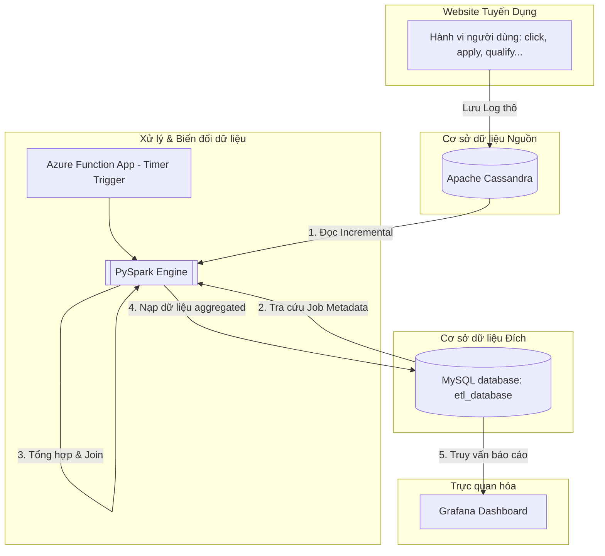

# Recruitment Marketing Data Pipeline (ETL & Dashboard)

Dự án này xây dựng một hệ thống **Data Pipeline (ETL)** tự động để thu thập, xử lý và trực quan hóa dữ liệu hành vi người dùng trên nền tảng tuyển dụng. Hệ thống giúp doanh nghiệp theo dõi hiệu quả của các tin tuyển dụng (Jobs), chiến dịch marketing (Campaigns) và các nguồn tuyển dụng (Publishers) theo thời gian thực (Near Real-time).

---

## 📌 1. Bài Toán Thực Tế (User Story & Business Problem)

### 🧑‍💻 User Story
> *"Khi người dùng tương tác với website tuyển dụng (ví dụ: xem tin tuyển dụng, nhấp chuột, ứng tuyển...), toàn bộ dữ liệu hành vi tương tác đó sẽ được ghi nhận và lưu trữ tức thời xuống cơ sở dữ liệu **NoSQL Cassandra** để đảm bảo khả năng ghi tốc độ cao và chịu tải lớn."*

### 💼 Bài Toán Doanh Nghiệp (Problem Statement)
Bộ phận kinh doanh và marketing của công ty cần phải **tính toán và tổng hợp** các chỉ số hiệu suất từ các tin tuyển dụng (jobs) đang chạy trên website bao gồm:
*   **Số lượt click** vào tin tuyển dụng.
*   **Số ứng viên nộp hồ sơ ứng tuyển** (Conversions).
*   **Số lượng hồ sơ đạt chuẩn** (Qualified) và **không đạt chuẩn** (Unqualified) sau khi lọc.

**Mục tiêu:** Giúp ban lãnh đạo và các chuyên viên tuyển dụng nắm bắt kịp thời tình hình thị trường lao động (tình hình ngành), tối ưu hóa ngân sách chạy quảng cáo tin tuyển dụng, và đánh giá chất lượng của từng nguồn cung cấp ứng viên (Publishers).

---

## 🏗️ 2. Kiến Trúc Hệ Thống (Architecture & Data Flow)

Hệ thống được thiết kế theo mô hình **Micro-batch ETL Pipeline** chạy trên hạ tầng container hóa **Docker**:



### Chi tiết luồng dữ liệu:
1.  **Thu thập dữ liệu:** Các tương tác thô của người dùng được ghi nhận vào bảng `tracking` trong **Cassandra**.
2.  **Kích hoạt định kỳ:** Một serverless **Azure Function** (giả lập chạy local) được kích hoạt bởi **Timer Trigger** sau mỗi 5 phút.
3.  **Xử lý dữ liệu lớn:** Tiến trình sử dụng **PySpark** để thực hiện:
    *   **Incremental Load (CDC):** Chỉ đọc các bản ghi mới từ Cassandra kể từ mốc thời gian đồng bộ gần nhất lưu trên MySQL, tối ưu hóa bằng cơ chế **TimeUUID Pushdown Filter**.
    *   **Aggregation:** Nhóm (Group by) dữ liệu theo Khung giờ (`hours`), Ngày (`dates`), Mã tin tuyển dụng (`job_id`), Nguồn (`publisher_id`), Chiến dịch (`campaign_id`) để tính toán số lượng click, conversion, qualified, unqualified và chi phí (`spend_hour`).
    *   **Join Metadata:** Kết hợp thông tin doanh nghiệp từ bảng `job` trong MySQL.
4.  **Lưu trữ:** Ghi kết quả tổng hợp vào bảng `events` trong **MySQL**.
5.  **Trực quan hóa:** **Grafana** truy vấn bảng `events` để hiển thị Dashboard thời gian thực cho người dùng cuối.

---

## 🗄️ 3. Cấu Trúc Bảng Dữ Liệu (Database Schema)

Dự án sử dụng cơ chế Micro-batch ETL để đồng bộ dữ liệu từ nguồn NoSQL (Cassandra) sang đích RDBMS (MySQL) phục vụ báo cáo. Cấu trúc chi tiết của các bảng dữ liệu như sau:

### A. Cassandra Source Schema (Bảng nguồn `recruitment.tracking`)
Bảng này lưu trữ dữ liệu thô (tracking log) được đẩy trực tiếp từ hành vi tương tác của người dùng trên website:

| Tên cột | Kiểu dữ liệu | Mô tả | Dữ liệu mẫu |
| :--- | :--- | :--- | :--- |
| **create_time** | TEXT (Primary Key) | Thời gian tạo sự kiện (UUIDv1/TimeUUID dạng chuỗi) | `'1eec8b70-f1c2-11ed-8f3e-00155d012401'` |
| **bid** | INT | Giá thầu quảng cáo (chỉ áp dụng cho `click`, mặc định `0`) | `2` |
| **bn** | TEXT | Tên trình duyệt (Browser Name) | `'Chrome'` |
| **campaign_id** | INT | Mã chiến dịch tuyển dụng | `10` |
| **cd** | INT | Độ sâu màu sắc màn hình (Color Depth) | `24` |
| **custom_track** | TEXT | Loại hành vi tương tác (`click`, `conversion`, `qualified`, `unqualified`) | `'click'` |
| **de** | TEXT | Mã hóa tài liệu (Document Encoding) | `'UTF-8'` |
| **dl** | TEXT | Đường dẫn liên kết trang web (Document Link) | `'http://localhost/jobs/1'` |
| **dt** | TEXT | Tiêu đề của trang (Document Title) | `'Python Developer Job'` |
| **ed** | TEXT | Mô tả sự kiện tùy chỉnh (Event Description) | `'Page view event'` |
| **ev** | INT | Giá trị sự kiện (Event Value) | `1` |
| **group_id** | INT | Mã nhóm tin tuyển dụng | `20` |
| **id** | TEXT | ID phiên của tracker | `'track_8f3e0015'` |
| **job_id** | INT | Mã tin tuyển dụng | `1` |
| **md** | TEXT | Thông tin thiết bị/phương tiện (Media Info) | `'desktop'` |
| **publisher_id** | INT | Mã nhà phát hành/nguồn tuyển dụng | `1` |
| **rl** | TEXT | Liên kết giới thiệu truy cập (Referrer Link) | `'https://google.com'` |
| **sr** | TEXT | Độ phân giải màn hình (Screen Resolution) | `'1920x1080'` |
| **ts** | TEXT | Mốc thời gian tương tác định dạng chuỗi | `'2026-06-24 10:30:00'` |
| **tz** | INT | Múi giờ lệch (Timezone Offset tính bằng phút) | `-420` |
| **ua** | TEXT | User Agent của trình duyệt | `'Mozilla/5.0...'` |
| **uid** | TEXT | ID định danh người dùng (User ID) | `'user_9921'` |
| **utm_campaign** | TEXT | Chiến dịch Marketing (UTM Campaign) | `'summer_2026'` |
| **utm_content** | TEXT | Nội dung quảng cáo (UTM Content) | `'banner_sidebar'` |
| **utm_medium** | TEXT | Phương tiện quảng cáo (UTM Medium) | `'cpc'` |
| **utm_source** | TEXT | Nguồn quảng cáo (UTM Source) | `'facebook'` |
| **utm_term** | TEXT | Từ khóa quảng cáo (UTM Term) | `'data_engineer'` |
| **v** | INT | Phiên bản của Tracker | `1` |
| **vp** | TEXT | Kích thước vùng hiển thị trình duyệt (Viewport Size) | `'1280x720'` |

> [!NOTE]
> Trong tiến trình ETL, chúng ta chủ yếu trích xuất và xử lý các cột dữ liệu cốt lõi phục vụ tính toán các chỉ số KPI: `create_time`, `job_id`, `publisher_id`, `campaign_id`, `group_id`, `custom_track`, `bid` và `ts`.

### B. MySQL Destination Schema (Bảng đích `etl_database.events`)
Bảng này lưu trữ dữ liệu tổng hợp (aggregated) sau khi chạy Spark ETL, dùng làm dữ liệu đầu vào cho Grafana để vẽ Dashboard:

| Tên cột | Kiểu dữ liệu | Mô tả | Dữ liệu mẫu |
| :--- | :--- | :--- | :--- |
| **id** | INT (Primary Key) | ID tự tăng của dòng | `2089` |
| **job_id** | INT | Mã tin tuyển dụng | `98` |
| **dates** | DATE | Ngày diễn ra tương tác | `2022-07-08` |
| **hours** | INT | Khung giờ tương tác (0 - 23) | `9` |
| **disqualified_application** | INT | Số lượng hồ sơ không đạt chuẩn (`unqualified`) | `1` |
| **qualified_application** | INT | Số lượng hồ sơ đạt chuẩn (`qualified`) | `0` |
| **conversion** | INT | Số lượng hồ sơ ứng tuyển thành công (`conversion`) | `1` |
| **company_id** | INT | Mã công ty tuyển dụng (được join từ bảng `job`) | `1` |
| **group_id** | INT | Mã nhóm tin tuyển dụng | `4` |
| **campaign_id** | INT | Mã chiến dịch marketing | `1` |
| **publisher_id** | INT | Mã nhà phát hành/nguồn quảng cáo | `2` |
| **bid_set** | DECIMAL(10,2) / DOUBLE | Đơn giá thầu trung bình (Average Bid) | `108.00` |
| **clicks** | INT | Tổng số lượt nhấp chuột (Clicks) | `216` |
| **impression** | INT | Số lượt hiển thị (nếu có) | `NULL` |
| **spend_hour** | DECIMAL(10,2) / DOUBLE | Tổng chi phí trong khung giờ (Spend = clicks * bid_set) | `216.00` |
| **sources** | VARCHAR(50) | Nguồn đồng bộ dữ liệu | `'Cassandra'` |
| **updated_at** | TIMESTAMP | Thời điểm đồng bộ/cập nhật dữ liệu | `2026-06-24 10:30:00` |

---

## 🛠️ 4. Công Nghệ Sử Dụng (Technology Stack)

*   **Database Nguồn (NoSQL):** **Apache Cassandra 4.1** (Phù hợp ghi log tương tác tốc độ cao, phân tán).
*   **Database Đích (RDBMS):** **MySQL 8.0** (Phù hợp lưu trữ dữ liệu có cấu trúc, phục vụ báo cáo/BI).
*   **Công cụ xử lý dữ liệu lớn:** **Apache Spark 3.5.1** (PySpark) chạy phân tán để tính toán song song.
*   **Hạ tầng Serverless:** **Azure Functions** (Timer Trigger) giúp tự động hóa lịch chạy và tối ưu hóa tài nguyên.
*   **Trực quan hóa:** **Grafana** để thiết lập Dashboard KPI trực quan.
*   **Điều phối container:** **Docker & Docker Compose** để đóng gói toàn bộ hệ thống phát triển cục bộ.

---

---

## 🚀 6. Hướng Dẫn Cài Đặt Và Chạy Hệ Thống

### 📋 Yêu cầu hệ thống:
*   Máy tính đã cài đặt **Docker** và **Docker Compose**.
*   **Python 3.10+** (được cài đặt trên máy host để chạy các kịch bản sinh dữ liệu và khởi tạo).

---

### Bước 1: Cài đặt thư viện Python ở máy Host
Trước khi chạy các kịch bản Python cục bộ, hãy cài đặt các thư viện kết nối cần thiết trên máy tính của bạn:
```bash
pip install pandas mysql-connector-python cassandra-driver requests
```

### Bước 2: Khởi động cụm dịch vụ bằng Docker Compose
Mở terminal tại thư mục dự án và chạy lệnh sau để khởi chạy toàn bộ các dịch vụ (MySQL, Cassandra, Spark, Azurite, Grafana, và Function App):
```bash
docker compose up -d --build
```
*Đợi khoảng 1-2 phút cho các container khởi động hoàn tất và kiểm tra trạng thái bằng lệnh:*
```bash
docker compose ps
```

### Bước 3: Khởi tạo cấu trúc bảng và dữ liệu mẫu (Seed Data)
Để đảm bảo Cassandra và MySQL được thiết lập sẵn sàng (tránh lỗi thiếu Keyspace/Table hoặc thiếu dữ liệu Job gốc), hãy chạy script khởi tạo sau:
```bash
python src/init_db.py
```
*Script này sẽ tự động tạo Keyspace `recruitment` và bảng `tracking` trong Cassandra, đồng thời tạo các bảng `job`, `master_publisher`, `events` và nạp sẵn dữ liệu mẫu trong MySQL.*

### Bước 4: Sinh dữ liệu tương tác ảo

Bạn có thể sinh dữ liệu ảo theo một trong hai cách dưới đây:

#### Cách A: Sinh dữ liệu trực tiếp vào Cassandra (Không qua API)
Chạy script để ghi trực tiếp các tương tác ngẫu nhiên vào database Cassandra:
```bash
python src/generate_dummy_data.py
```
*Script này truy cập MySQL lấy thông tin Metadata (Jobs, Publishers), sau đó tạo dữ liệu thô và ghi thẳng vào Cassandra mỗi 30 giây.*

#### Cách B: Sinh dữ liệu thông qua HTTP API (Gọi tới API `/api/track`)
Chạy script để giả lập client liên tục bắn request HTTP POST chứa JSON payload tới API của Function App:
```bash
python src/generate_dummy_data_api.py
```
*Script này sẽ gọi tới `http://127.0.0.1:8082/api/track`, giúp kiểm tra tính năng xử lý bất đồng bộ (Lưu Cassandra -> Gửi Queue -> Kích hoạt Spark ETL ngầm).*

### Bước 5: Quan sát tiến trình ETL hoạt động
*   Theo lịch trình mặc định, **Azure Function** sẽ thức dậy mỗi **5 phút** một lần để chạy tiến trình ETL PySpark.
*   Bạn có thể theo dõi tiến độ xử lý và logs của ETL bằng cách chạy lệnh:
    ```bash
    docker logs -f etl_function_app
    ```
*   Khi có dữ liệu mới, log sẽ thông báo nạp thành công dữ liệu gia tăng (Incremental Sync) vào MySQL. Nếu không có dữ liệu mới, tiến trình sẽ thông báo bỏ qua lượt chạy để tiết kiệm tài nguyên.

### Bước 6: Thiết lập Dashboard trên Grafana
1.  Truy cập Grafana tại địa chỉ: [http://localhost:3000](http://localhost:3000) (tài khoản: `admin` / mật khẩu: `admin`).
2.  Kết nối Data Source là **MySQL** với thông tin kết nối:
    *   **Host:** `mysql:3306`
    *   **Database:** `etl_database`
    *   **User:** `root`
    *   **Password:** `123`
3.  Truy cập trực tiếp Dashboard đã lưu bằng đường link rút gọn sau:
    
    [](http://localhost:3000/goto/dfq2eloq0clj4f?orgId=1)
    
    *(Hoặc link: [http://localhost:3000/goto/dfq2eloq0clj4f?orgId=1](http://localhost:3000/goto/dfq2eloq0clj4f?orgId=1))*

    **Giao diện Dashboard trực quan:**
    


