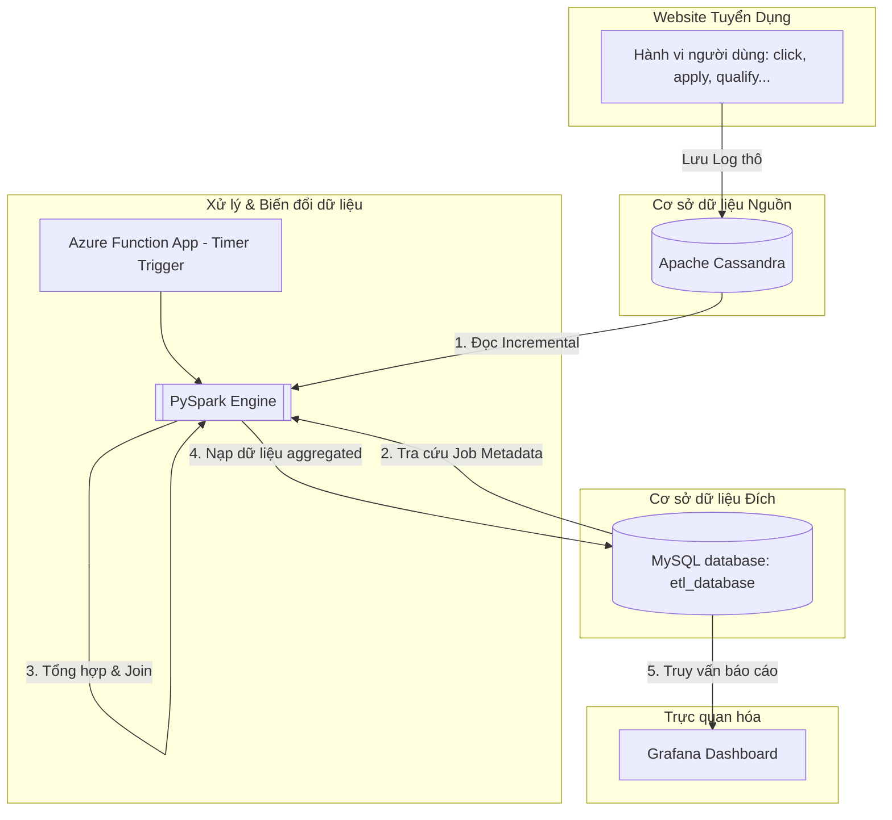
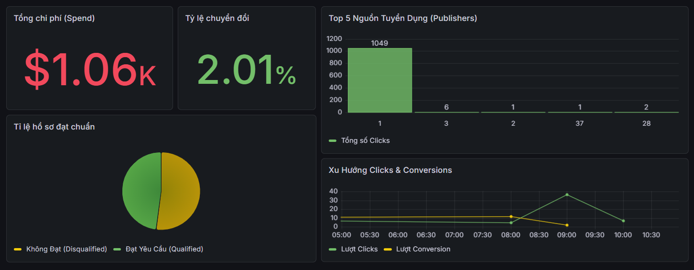

## 📌 1. Bối Cảnh & Nhiệm Vụ (Situation & Task)

### 🎬 Situation (Bối cảnh)
Bộ phận kinh doanh và marketing của nền tảng tuyển dụng trực tuyến cần liên tục theo dõi hiệu suất của các tin tuyển dụng (Jobs), chiến dịch marketing (Campaigns) và nguồn cung cấp ứng viên (Publishers). Dữ liệu hành vi người dùng được sinh ra từ việc tương tác website liên tục đổ về Cassandra nhưng được lưu trữ dưới dạng log thô, chưa được làm sạch hay tổng hợp. Điều này khiến doanh nghiệp gặp nhiều khó khăn trong việc đánh giá nhanh tình hình thị trường lao động và đưa ra quyết định tối ưu hóa ngân sách chạy quảng cáo tin tuyển dụng.

### 🎯 Task (Nhiệm vụ)
Xây dựng hệ thống **Data Pipeline (ETL)** tự động thu thập hành vi người dùng từ Cassandra, tổng hợp các chỉ số hiệu suất (Clicks, Conversions, Qualified/Unqualified) và nạp vào MySQL phục vụ báo cáo Near Real-time.


---

## 🏗️ 2. Giải Pháp & Kết Quả (Action & Result)

### 🛠️ Action (Hành động)
Tôi đã thiết kế và triển khai một kiến trúc **Micro-batch ETL** trên hạ tầng container hóa **Docker** (giả lập môi trường cloud Azure Functions và databases) với luồng xử lý chi tiết như sau:

#### 📐 Sơ đồ kiến trúc & Luồng dữ liệu (Architecture & Data Flow)


#### ⚙️ Chi tiết luồng xử lý:
1.  **Điều phối tự động (Orchestrator)**: Thiết lập **Azure Function App** (với Timer Trigger) làm thành phần kích hoạt tiến trình ETL định kỳ mỗi 3 phút (hỗ trợ cả cơ chế trigger bất đồng bộ qua Azure Queue Storage).
2.  **Xử lý dữ liệu lớn với PySpark**:
    *   **Incremental Load (CDC)**: Trích xuất dữ liệu hành vi thô từ database NoSQL **Apache Cassandra**,  chỉ lấy các bản ghi mới kể từ lần đồng bộ gần nhất, tránh quét toàn bộ bảng (Full table scan).
    *   **Data Aggregation**: Nhóm dữ liệu đa chiều theo Khung giờ (`hours`), Ngày (`dates`), Mã tin (`job_id`), Nguồn (`publisher_id`) và Chiến dịch (`campaign_id`) để tính toán số lượng tương tác, conversion và chi phí (`spend_hour`).
    *   **Data Enrichment**: Kết hợp (Join) luồng dữ liệu thô đang xử lý với thông tin danh nghiệp (Job Metadata, Publisher Metadata) từ **MySQL** để làm giàu thông tin tuyển dụng.
3.  **Lưu trữ & Trực quan hóa**:
    *   **Load**: Nạp dữ liệu đã tổng hợp (aggregated data) vào bảng đích `events` trong **MySQL** sử dụng Spark JDBC connector.
    *   **Visualize**: Kết nối **Grafana** với MySQL để xây dựng các báo cáo thời gian thực giúp giám sát và ra quyết định.

### 🏆 Result (Kết quả)
Triển khai thành công hệ thống giám sát Near Real-time. Dữ liệu được xử lý trơn tru và trực quan hóa rõ ràng trên Grafana Dashboard, giúp ban lãnh đạo và chuyên viên tuyển dụng:
*   Theo dõi và tổng hợp chính xác các chỉ số hiệu suất của từng tin tuyển dụng.
*   Đánh giá chính xác chất lượng ứng viên từ các nguồn cung cấp (Publishers) khác nhau.
*   Nắm bắt kịp thời tình hình ngành và đưa ra các quyết định tối ưu hóa ngân sách chạy quảng cáo hiệu quả.

---

## 🚀 3. Hướng Dẫn Cài Đặt Và Chạy Hệ Thống

### 📋 Yêu cầu hệ thống:
*   Máy tính đã cài đặt **Docker** và **Docker Compose**.
*   **Python 3.10+** (được cài đặt trên máy host để chạy các kịch bản sinh dữ liệu và khởi tạo).

---

### Bước 1: Cài đặt thư viện Python ở máy Host
Trước khi chạy các kịch bản Python cục bộ, hãy cài đặt các thư viện kết nối cần thiết trên máy tính của bạn:
```bash
pip install pandas mysql-connector-python cassandra-driver requests
```

### Bước 2: Khởi động cụm dịch vụ bằng Docker Compose
Mở terminal tại thư mục dự án và chạy lệnh sau để khởi chạy toàn bộ các dịch vụ (MySQL, Cassandra, Spark, Azurite, Grafana, và Function App):
```bash
docker compose up -d --build
```
*Đợi khoảng 1-2 phút cho các container khởi động hoàn tất và kiểm tra trạng thái bằng lệnh:*
```bash
docker compose ps
```

### Bước 3: Khởi tạo cấu trúc bảng và dữ liệu mẫu (Seed Data)
Để đảm bảo Cassandra và MySQL được thiết lập sẵn sàng (tránh lỗi thiếu Keyspace/Table hoặc thiếu dữ liệu Job gốc), hãy chạy script khởi tạo sau:
```bash
python src/init_db.py
```
*Script này sẽ tự động tạo Keyspace `recruitment` và bảng `tracking` trong Cassandra, đồng thời tạo các bảng `job`, `master_publisher`, `events` và nạp sẵn dữ liệu mẫu trong MySQL.*

### Bước 4: Sinh dữ liệu tương tác ảo

Bạn có thể sinh dữ liệu ảo theo một trong hai cách dưới đây:

#### Cách A: Sinh dữ liệu trực tiếp vào Cassandra (Không qua API)
Chạy script để ghi trực tiếp các tương tác ngẫu nhiên vào database Cassandra:
```bash
python src/generate_dummy_data.py
```
*Script này truy cập MySQL lấy thông tin Metadata (Jobs, Publishers), sau đó tạo dữ liệu thô và ghi thẳng vào Cassandra mỗi 30 giây.*

#### Cách B: Sinh dữ liệu thông qua HTTP API (Gọi tới API `/api/track`)
Chạy script để giả lập client liên tục bắn request HTTP POST chứa JSON payload tới API của Function App:
```bash
python src/generate_dummy_data_api.py
```
*Script này sẽ gọi tới `http://127.0.0.1:8082/api/track`, giúp kiểm tra tính năng xử lý bất đồng bộ (Lưu Cassandra -> Gửi Queue -> Kích hoạt Spark ETL ngầm).*

### Bước 5: Quan sát tiến trình ETL hoạt động
*   Theo lịch trình mặc định, **Azure Function** sẽ thức dậy mỗi **5 phút** một lần để chạy tiến trình ETL PySpark.
*   Bạn có thể theo dõi tiến độ xử lý và logs của ETL bằng cách chạy lệnh:
    ```bash
    docker logs -f etl_function_app
    ```
*   Khi có dữ liệu mới, log sẽ thông báo nạp thành công dữ liệu gia tăng (Incremental Sync) vào MySQL. Nếu không có dữ liệu mới, tiến trình sẽ thông báo bỏ qua lượt chạy để tiết kiệm tài nguyên.

### Bước 6: Thiết lập Dashboard trên Grafana
1.  Truy cập Grafana tại địa chỉ: [http://localhost:3000](http://localhost:3000) (tài khoản: `admin` / mật khẩu: `admin`).
2.  Kết nối Data Source là **MySQL** với thông tin kết nối:
    *   **Host:** `mysql:3306`
    *   **Database:** `etl_database`
    *   **User:** `root`
    *   **Password:** `123`
3.  Truy cập trực tiếp Dashboard đã lưu bằng đường link rút gọn sau:
    
    [](http://localhost:3000/goto/dfq2eloq0clj4f?orgId=1)
    
    *(Hoặc link: [http://localhost:3000/goto/dfq2eloq0clj4f?orgId=1](http://localhost:3000/goto/dfq2eloq0clj4f?orgId=1))*

    **Giao diện Dashboard trực quan:**
    


