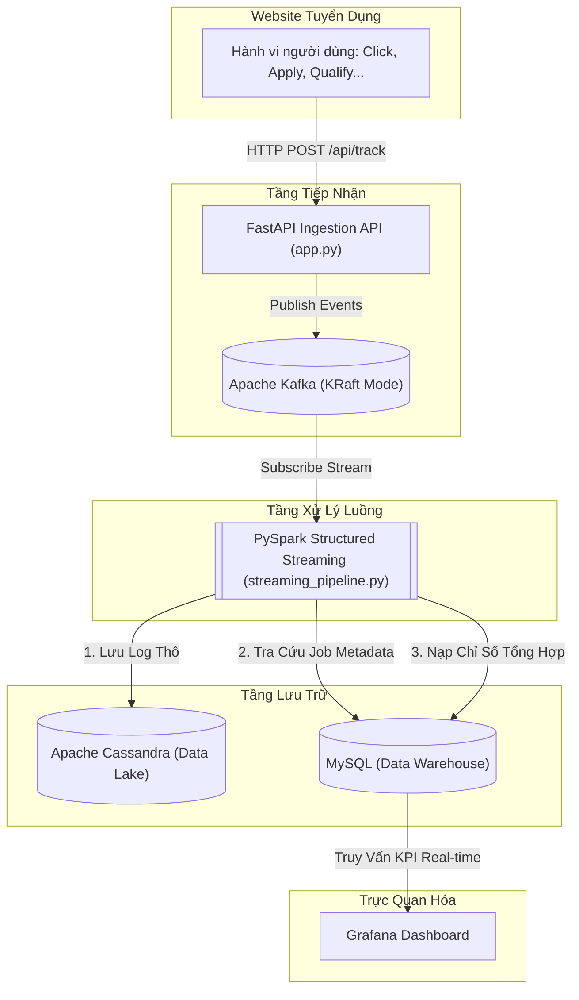

# 🚀 Recruitment Data Pipeline - Kafka & Spark Structured Streaming

Hệ thống Data Pipeline xử lý hành vi người dùng thời gian thực (Real-time Clickstream Processing) cho nền tảng tuyển dụng trực tuyến, chuyển đổi kiến trúc từ Batch Processing cũ sang **Event-Driven Streaming Architecture** sử dụng **FastAPI, Apache Kafka, Apache Cassandra, PySpark Structured Streaming, MySQL và Grafana**.

---

## 📌 1. Bối Cảnh & Nhiệm Vụ (Situation & Task)

### 🎬 Situation (Bối cảnh)
Bộ phận kinh doanh và marketing của nền tảng tuyển dụng trực tuyến cần liên tục theo dõi hiệu suất của các tin tuyển dụng (Jobs), chiến dịch quảng cáo (Campaigns) và nguồn cung cấp ứng viên (Publishers) theo thời gian thực. 
Trước đây, hệ thống chạy cơ chế Batch (quét Cassandra 3 phút/lần) có độ trễ lớn (~3 phút), thường xuyên quá tải CPU và bị nghẽn kết nối. Doanh nghiệp cần một giải pháp xử lý tức thời để đánh giá nhanh tình hình thị trường lao động và đưa ra quyết định tối ưu hóa ngân sách quảng cáo ngay lập tức.

### 🎯 Task (Nhiệm vụ)
Di chuyển toàn bộ kiến trúc pipeline sang **Real-time Streaming**:
* Xây dựng API tiếp nhận sự kiện phản hồi siêu tốc.
* Thiết lập hàng đợi sự kiện chịu tải cao để lưu vết lịch sử.
* Phát triển Spark Structured Streaming xử lý biến đổi, làm giàu dữ liệu (Stream-to-Static Join) và tổng hợp tức thời.
* **Mục tiêu độ trễ (Latency):** Giảm từ 3 phút xuống **dưới 10 giây (thực tế đạt ~7 giây)**.

---

## 🏗️ 2. Kiến Trúc Hệ Thống & Luồng Dữ Liệu

### 📐 Sơ đồ kiến trúc (Architecture Flowchart)

```mermaid
flowchart TD
    subgraph Web_Client [Website Tuyển Dụng]
        UserInteract["Hành vi người dùng: Click, Apply, Qualify..."]
    end

    subgraph Ingestion_Layer [Tầng Tiếp Nhận]
        FastAPI["FastAPI Ingestion API (app.py)"]
        KafkaBroker[("Apache Kafka (KRaft Mode)")]
        UserInteract -->|HTTP POST /api/track| FastAPI
        FastAPI -->|Publish Events| KafkaBroker
    end

    subgraph Processing_Layer [Tầng Xử Lý Luồng]
        SparkStreaming[["PySpark Structured Streaming (streaming_pipeline.py)"]]
        KafkaBroker -->|Subscribe Stream| SparkStreaming
    end

    subgraph Storage_Layer [Tầng Lưu Trữ]
        Cassandra[("Apache Cassandra (Data Lake)")]
        MySQL[("MySQL (Data Warehouse)")]
        SparkStreaming -->|1. Lưu Log Thô| Cassandra
        SparkStreaming -->|2. Tra Cứu Job Metadata| MySQL
        SparkStreaming -->|3. Nạp Chỉ Số Tổng Hợp| MySQL
    end

    subgraph Visualization_Layer [Trực Quan Hóa]
        Grafana["Grafana Dashboard"]
        MySQL -->|Truy Vấn KPI Real-time| Grafana
    end
```

### ⚙️ Chi tiết luồng xử lý:
1. **API Ingestion (FastAPI):** Tiếp nhận gói tin tracking từ client, đóng gói payload, sinh định danh UUIDv1 và đẩy bất đồng bộ (Asynchronous) vào Kafka Topic `recruitment-tracking` trong vòng **2ms**.
2. **Event Broker (Kafka KRaft):** Đóng vai trò hàng đợi sự kiện, lưu trữ tạm thời và đảm bảo thứ tự thời gian của luồng sự kiện.
3. **Real-time Processing (PySpark Structured Streaming):**
   * Đăng ký lắng nghe Kafka Stream, tự động phân giải JSON từ byte nhị phân dựa trên Schema định sẵn.
   * **Write to Data Lake:** Ghi trực tiếp log thô vào **Cassandra** phục vụ phân tích chuyên sâu sau này.
   * **Stream-to-Static Join:** Ghép nối dữ liệu stream với bảng dữ liệu tĩnh `job` trong **MySQL** để lấy mã công ty (`company_id`).
   * **Aggregation:** Tổng hợp chỉ số (Clicks, Conversions, Qualified/Unqualified, Spend) theo giờ và theo ngày.
   * **Write to Data Warehouse:** Ghi đè cập nhật số liệu trực tiếp vào bảng `events` của **MySQL**.
4. **Dashboard (Grafana):** Kết nối trực tiếp vào MySQL hiển thị đồ thị tương tác nhảy số thời gian thực với **tổng độ trễ luồng chỉ ~7 giây**.

---

## 🚀 3. Hướng Dẫn Cài Đặt Và Chạy Hệ Thống

### 📋 Yêu cầu hệ thống:
* Máy tính đã cài đặt **Docker** và **Docker Compose**.
* **Python 3.10+** chạy trên máy Host (để chạy script sinh dữ liệu).

---

### Bước 1: Cài đặt thư viện Python ở máy Host
Cài đặt các thư viện hỗ trợ kịch bản test:
```bash
pip install pandas mysql-connector-python kafka-python requests
```

### Bước 2: Khởi động hệ thống bằng Docker Compose
Khởi chạy toàn bộ hạ tầng (Kafka, FastAPI, Spark Worker, Cassandra, MySQL, Grafana):
```bash
docker compose up -d --build
```
*Đợi các container khởi động hoàn toàn, kiểm tra trạng thái hoạt động:*
```bash
docker compose ps
```

### Bước 3: Khởi tạo cấu trúc cơ sở dữ liệu
Để tạo các bảng và keyspace cần thiết, chạy script:
```bash
python src/init_db.py
```

### Bước 4: Chạy luồng giả lập sinh dữ liệu liên tục (Generator)
Bạn có thể sinh dữ liệu ảo bằng một trong hai cách:

#### Cách A: Sinh dữ liệu trực tiếp vào Cassandra (Bypass API)
```bash
python src/generate_dummy_data.py
```
*Script này ghi dữ liệu trực tiếp vào Cassandra để giả lập hệ thống cũ.*

#### Cách B: Bắn dữ liệu liên tục qua Ingestion API (Được khuyến nghị)
```bash
python src/generate_dummy_data_api.py
```
*Script này liên tục thực hiện cuộc gọi HTTP POST gửi JSON payload tới `/api/track` (cổng `8082`), đi qua toàn bộ luồng Ingestion (FastAPI -> Kafka -> Spark -> Cassandra/MySQL).*

---

### Bước 5: Theo dõi log Spark Streaming hoạt động
Để kiểm tra xem PySpark Structured Streaming có đang đọc và xử lý micro-batch từ Kafka hay không, hãy chạy:
```bash
docker logs -f etl_streaming_worker
```
*Mỗi khi có dữ liệu mới đổ về từ API, bạn sẽ thấy Spark in log xử lý và lưu trữ thành công:*
```text
INFO - === Đang xử lý Micro-batch 0 - Số lượng bản ghi: 5 ===
INFO - Đã ghi log thô thành công vào Cassandra.
INFO - Đã gộp và đồng bộ hóa thành công dữ liệu KPI lên MySQL!
```

---

### Bước 6: Xem kết quả trên Grafana Dashboard
1. Truy cập Grafana tại địa chỉ: [http://localhost:3000](http://localhost:3000) (Tài khoản mặc định: `admin` / `admin`).
2. Data Source **MySQL** đã được cấu hình sẵn trong docker compose (hoặc tự cấu hình kết nối tới `mysql:3306`, database: `etl_database`).
3. Truy cập trực tiếp link Dashboard: [http://localhost:3000/goto/dfq2eloq0clj4f?orgId=1](http://localhost:3000/goto/dfq2eloq0clj4f?orgId=1)
4. Quan sát số liệu nhảy liên tục thời gian thực sau mỗi lượt click/apply.

---

## 🌐 4. Kiểm Thử Trên Môi Trường Cloud Production

Khi dự án được deploy lên Cloud (ví dụ DigitalOcean Droplet), bạn có thể kiểm thử luồng và theo dõi dữ liệu bằng các địa chỉ sau:

### 📊 4.1. Xem Grafana Dashboard Trực Quan
* **URL:** `http://159.223.41.98:3000`
* **Tài khoản đăng nhập mặc định:** `admin` / `Tu@nloc00`
* **Đường dẫn trực tiếp đến Dashboard:** [http://159.223.41.98:3000/goto/dfq2eloq0clj4f?orgId=1](http://159.223.41.98:3000/goto/dfq2eloq0clj4f?orgId=1)
* *Lưu ý:* Chọn refresh rate hoặc nhấn refresh trên Grafana để thấy số liệu thay đổi ngay lập tức sau khi gửi event.

### 📥 4.2. Gửi Event thủ công qua API:
* **Method:** `POST`
* **URL:** `http://159.223.41.98:8082/api/track`
* **Headers:** `Content-Type: application/json`
* **Body mẫu:**
```json
{
  "custom_track": "click",
  "bid": 2,
  "job_id": 1,
  "publisher_id": 1,
  "campaign_id": 10,
  "group_id": 20
}
```

### 💻 4.3. Xem qua giao diện Interactive Web UI:
* **URL:** `http://159.223.41.98:8082/api/ui` (Hoặc `http://localhost:8082/api/ui` khi chạy local)
* **Chức năng:** Giao diện HTML giả lập cho phép click nút gửi sự kiện trực tiếp trên trình duyệt để kiểm tra luồng dữ liệu thời gian thực.
