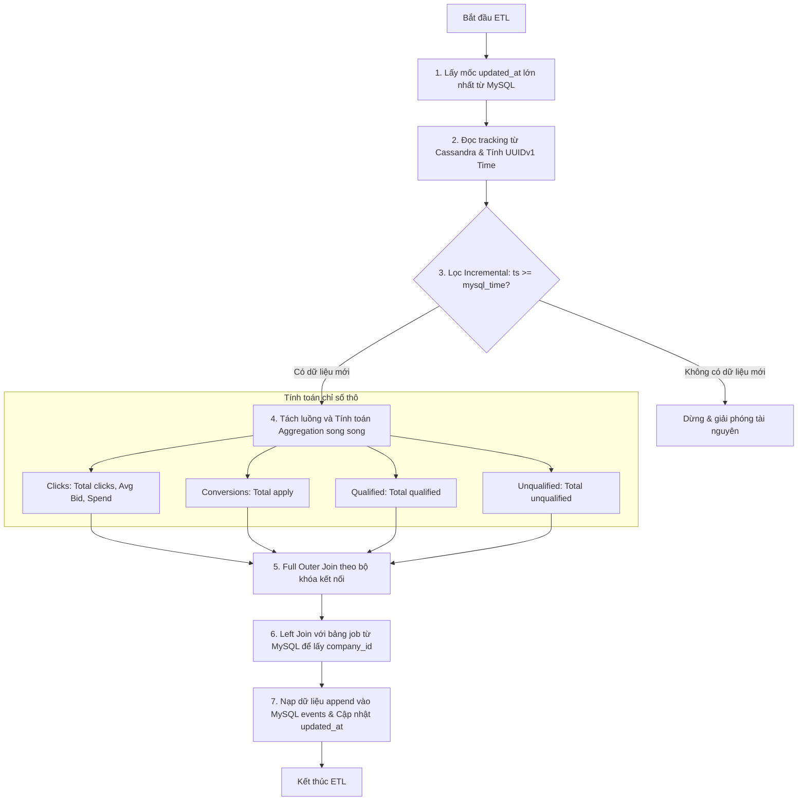

# 🛠️ Thông Tin Kỹ Thuật Chi Tiết (Technical Details)

Tài liệu này chứa thông tin chi tiết về cấu trúc bảng dữ liệu, công nghệ sử dụng và quy trình xử lý ETL của hệ thống recruitment data pipeline.

---

## 🗄️ 3. Cấu Trúc Bảng Dữ Liệu (Database Schema)

Dự án sử dụng cơ chế Micro-batch ETL để đồng bộ dữ liệu từ nguồn NoSQL (Cassandra) sang đích RDBMS (MySQL) phục vụ báo cáo. Cấu trúc chi tiết của các bảng dữ liệu như sau:

### A. Cassandra Source Schema (Bảng nguồn `recruitment.tracking`)
Bảng này lưu trữ dữ liệu thô (tracking log) được đẩy trực tiếp từ hành vi tương tác của người dùng trên website:

| Tên cột | Kiểu dữ liệu | Mô tả | Dữ liệu mẫu |
| :--- | :--- | :--- | :--- |
| **create_time** | TEXT (Primary Key) | Thời gian tạo sự kiện (UUIDv1/TimeUUID dạng chuỗi) | `'1eec8b70-f1c2-11ed-8f3e-00155d012401'` |
| **bid** | INT | Giá thầu quảng cáo (chỉ áp dụng cho `click`, mặc định `0`) | `2` |
| **bn** | TEXT | Tên trình duyệt (Browser Name) | `'Chrome'` |
| **campaign_id** | INT | Mã chiến dịch tuyển dụng | `10` |
| **cd** | INT | Độ sâu màu sắc màn hình (Color Depth) | `24` |
| **custom_track** | TEXT | Loại hành vi tương tác (`click`, `conversion`, `qualified`, `unqualified`) | `'click'` |
| **de** | TEXT | Mã hóa tài liệu (Document Encoding) | `'UTF-8'` |
| **dl** | TEXT | Đường dẫn liên kết trang web (Document Link) | `'http://localhost/jobs/1'` |
| **dt** | TEXT | Tiêu đề của trang (Document Title) | `'Python Developer Job'` |
| **ed** | TEXT | Mô tả sự kiện tùy chỉnh (Event Description) | `'Page view event'` |
| **ev** | INT | Giá trị sự kiện (Event Value) | `1` |
| **group_id** | INT | Mã nhóm tin tuyển dụng | `20` |
| **id** | TEXT | ID phiên của tracker | `'track_8f3e0015'` |
| **job_id** | INT | Mã tin tuyển dụng | `1` |
| **md** | TEXT | Thông tin thiết bị/phương tiện (Media Info) | `'desktop'` |
| **publisher_id** | INT | Mã nhà phát hành/nguồn tuyển dụng | `1` |
| **rl** | TEXT | Liên kết giới thiệu truy cập (Referrer Link) | `'https://google.com'` |
| **sr** | TEXT | Độ phân giải màn hình (Screen Resolution) | `'1920x1080'` |
| **ts** | TEXT | Mốc thời gian tương tác định dạng chuỗi | `'2026-06-24 10:30:00'` |
| **tz** | INT | Múi giờ lệch (Timezone Offset tính bằng phút) | `-420` |
| **ua** | TEXT | User Agent của trình duyệt | `'Mozilla/5.0...'` |
| **uid** | TEXT | ID định danh người dùng (User ID) | `'user_9921'` |
| **utm_campaign** | TEXT | Chiến dịch Marketing (UTM Campaign) | `'summer_2026'` |
| **utm_content** | TEXT | Nội dung quảng cáo (UTM Content) | `'banner_sidebar'` |
| **utm_medium** | TEXT | Phương tiện quảng cáo (UTM Medium) | `'cpc'` |
| **utm_source** | TEXT | Nguồn quảng cáo (UTM Source) | `'facebook'` |
| **utm_term** | TEXT | Từ khóa quảng cáo (UTM Term) | `'data_engineer'` |
| **v** | INT | Phiên bản của Tracker | `1` |
| **vp** | TEXT | Kích thước vùng hiển thị trình duyệt (Viewport Size) | `'1280x720'` |

> [!NOTE]
> Trong tiến trình ETL, chúng ta chủ yếu trích xuất và xử lý các cột dữ liệu cốt lõi phục vụ tính toán các chỉ số KPI: `create_time`, `job_id`, `publisher_id`, `campaign_id`, `group_id`, `custom_track`, `bid` và `ts`.

### B. MySQL Destination Schema (Bảng đích `etl_database.events`)
Bảng này lưu trữ dữ liệu tổng hợp (aggregated) sau khi chạy Spark ETL, dùng làm dữ liệu đầu vào cho Grafana để vẽ Dashboard:

| Tên cột | Kiểu dữ liệu | Mô tả | Dữ liệu mẫu |
| :--- | :--- | :--- | :--- |
| **id** | INT (Primary Key) | ID tự tăng của dòng | `2089` |
| **job_id** | INT | Mã tin tuyển dụng | `98` |
| **dates** | DATE | Ngày diễn ra tương tác | `2022-07-08` |
| **hours** | INT | Khung giờ tương tác (0 - 23) | `9` |
| **disqualified_application** | INT | Số lượng hồ sơ không đạt chuẩn (`unqualified`) | `1` |
| **qualified_application** | INT | Số lượng hồ sơ đạt chuẩn (`qualified`) | `0` |
| **conversion** | INT | Số lượng hồ sơ ứng tuyển thành công (`conversion`) | `1` |
| **company_id** | INT | Mã công ty tuyển dụng (được join từ bảng `job`) | `1` |
| **group_id** | INT | Mã nhóm tin tuyển dụng | `4` |
| **campaign_id** | INT | Mã chiến dịch marketing | `1` |
| **publisher_id** | INT | Mã nhà phát hành/nguồn quảng cáo | `2` |
| **bid_set** | DECIMAL(10,2) / DOUBLE | Đơn giá thầu trung bình (Average Bid) | `108.00` |
| **clicks** | INT | Tổng số lượt nhấp chuột (Clicks) | `216` |
| **impression** | INT | Số lượt hiển thị (nếu có) | `NULL` |
| **spend_hour** | DECIMAL(10,2) / DOUBLE | Tổng chi phí trong khung giờ (Spend = clicks * bid_set) | `216.00` |
| **sources** | VARCHAR(50) | Nguồn đồng bộ dữ liệu | `'Cassandra'` |
| **updated_at** | TIMESTAMP | Thời điểm đồng bộ/cập nhật dữ liệu | `2026-06-24 10:30:00` |

### C. MySQL Job Metadata Schema (Bảng `job`)
Bảng này lưu trữ thông tin chi tiết về các tin tuyển dụng, dùng để tham chiếu (Join) và làm giàu dữ liệu trong tiến trình ETL:

| Tên cột | Kiểu dữ liệu | Mô tả | Dữ liệu mẫu |
| :--- | :--- | :--- | :--- |
| **id** | INT (Primary Key) | Mã định danh tin tuyển dụng | `1` |
| **created_by** | VARCHAR(255) | Người tạo bản ghi | `'admin'` |
| **created_date** | TIMESTAMP | Thời gian tạo bản ghi | `2026-06-24 10:30:00` |
| **last_modified_by** | VARCHAR(255) | Người cập nhật cuối cùng | `'admin'` |
| **last_modified_date** | TIMESTAMP | Thời gian cập nhật cuối cùng | `2026-06-24 10:30:00` |
| **is_active** | TINYINT | Trạng thái hoạt động (1: Active, 0: Inactive) | `1` |
| **title** | VARCHAR(255) | Tiêu đề công việc | `'Python Developer'` |
| **description** | TEXT | Mô tả công việc | `'Description Python Developer'` |
| **work_schedule** | VARCHAR(50) | Hình thức làm việc (Full-time, Part-time...) | `'FULL_TIME'` |
| **radius_unit** | VARCHAR(50) | Đơn vị bán kính tìm kiếm ứng viên | `NULL` |
| **location_street** | VARCHAR(255) | Số nhà, tên đường làm việc | `NULL` |
| **location_locality** | VARCHAR(255) | Địa điểm/Thành phố làm việc | `NULL` |
| **role_location** | VARCHAR(50) | Hình thức làm việc (Remote, Onsite, Hybrid...) | `'REMOTE'` |
| **resume_optional** | VARCHAR(50) | Yêu cầu hồ sơ xin việc (Bắt buộc hay không) | `'REQUIRED'` |
| **budget** | DECIMAL(10,2) | Ngân sách tối đa cho tin tuyển dụng | `50.00` |
| **status** | INT | Trạng thái tin tuyển dụng | `1` |
| **error** | VARCHAR(255) | Thông tin lỗi hệ thống (nếu có) | `NULL` |
| **template_layout** | INT | Giao diện hiển thị tin tuyển dụng | `16` |
| **template_options** | INT | Các cấu hình giao diện hiển thị | `NULL` |
| **question_template** | INT | Mẫu câu hỏi tuyển dụng đính kèm | `NULL` |
| **redirect_url** | VARCHAR(255) | URL chuyển hướng khi ứng viên nộp đơn | `'http://localhost/job/1'` |
| **start_date** | TIMESTAMP | Ngày bắt đầu tuyển dụng | `NULL` |
| **end_date** | TIMESTAMP | Ngày kết thúc dự kiến | `NULL` |
| **close_date** | TIMESTAMP | Ngày đóng tin thực tế | `NULL` |
| **group_id** | INT | Mã nhóm tin tuyển dụng | `20` |
| **minor_id** | INT | Mã ngành phụ | `1` |
| **campaign_id** | INT | Mã chiến dịch quảng cáo | `10` |
| **company_id** | INT | Mã công ty sở hữu tin tuyển dụng | `1` |
| **history_store** | INT | Trạng thái lưu lịch sử của hệ thống | `2` |
| **ref_id** | INT | ID tham chiếu hệ thống khác | `2` |

### D. MySQL Publisher Metadata Schema (Bảng `master_publisher`)
Bảng này lưu trữ thông tin về các nguồn cung cấp ứng viên/nhà phát hành quảng cáo (Publishers) để liên kết tính toán chi phí:

| Tên cột | Kiểu dữ liệu | Mô tả | Dữ liệu mẫu |
| :--- | :--- | :--- | :--- |
| **id** | INT (Primary Key) | Mã định danh Publisher | `1` |
| **created_by** | VARCHAR(255) | Người tạo bản ghi | `'admin'` |
| **created_date** | TIMESTAMP | Thời gian tạo bản ghi | `2026-06-24 10:30:00` |
| **last_modified_by** | VARCHAR(255) | Người cập nhật cuối cùng | `'admin'` |
| **last_modified_date** | TIMESTAMP | Thời gian cập nhật cuối cùng | `2026-06-24 10:30:00` |
| **is_active** | TINYINT | Trạng thái hoạt động (1: Active, 0: Inactive) | `1` |
| **publisher_name** | VARCHAR(255) | Tên nguồn/kênh tuyển dụng | `'Facebook'` |
| **publisher_email** | VARCHAR(255) | Email liên hệ của Publisher | `'Facebook@mail.com'` |
| **access_token** | VARCHAR(255) | Token bảo mật để gửi log | `'b01aba43-'` |
| **publisher_type** | INT | Loại kênh tuyển dụng | `0` |
| **publisher_group** | INT | Nhóm kênh tuyển dụng | `1` |
| **publisher_code** | INT | Mã code kênh | `0` |
| **publisher_currency** | VARCHAR(50) | Đơn vị tiền tệ áp dụng giá thầu | `'1'` |
| **time_zone** | VARCHAR(100) | Múi giờ làm việc của Publisher | `'SE Asia Standard Time'` |
| **cpc_increment** | DECIMAL(10,2) | Mức gia tăng chi phí trên mỗi click | `0.00` |
| **bid_reading_interval** | INT | Chu kỳ đọc giá thầu | `1` |
| **min_bid** | DECIMAL(10,2) | Giá thầu tối thiểu chấp nhận | `1.00` |
| **max_bid** | DECIMAL(10,2) | Giá thầu tối đa chấp nhận | `1.00` |
| **countries** | VARCHAR(255) | Quốc gia hoạt động tuyển dụng | `'VN'` |
| **data_sharing** | TEXT | Danh sách cấu hình chia sẻ dữ liệu doanh nghiệp | `'[]'` |

---

## 🛠️ 4. Công Nghệ Sử Dụng (Technology Stack)

*   **Database Nguồn (NoSQL):** **Apache Cassandra 4.1** (Phù hợp ghi log tương tác tốc độ cao, phân tán).
*   **Database Đích (RDBMS):** **MySQL 8.0** (Phù hợp lưu trữ dữ liệu có cấu trúc, phục vụ báo cáo/BI).
*   **Công cụ xử lý dữ liệu lớn:** **Apache Spark 3.5.1** (PySpark) chạy phân tán để tính toán song song.
*   **Hạ tầng Serverless:** **Azure Functions** (Timer Trigger) giúp tự động hóa lịch chạy và tối ưu hóa tài nguyên.
*   **Trực quan hóa:** **Grafana** để thiết lập Dashboard KPI trực quan.
*   **Điều phối container:** **Docker & Docker Compose** để đóng gói toàn bộ hệ thống phát triển cục bộ.

---

## 🔄 5. Quy Trình Xử Lý ETL Chi Tiết (ETL Process Workflow)

Tiến trình ETL cốt lõi được định nghĩa trong [etl_pipeline.py](file:///e:/DataEngineer/DE/Class4/Data_pipeline_for_recruitment_start_up/src/etl_pipeline.py), hoạt động dựa trên cơ chế **Micro-batch** kết hợp giữa kích hoạt định kỳ (Timer Trigger - 3 phút/lần) và kích hoạt theo luồng sự kiện chạy ngầm (Queue Trigger). Quy trình xử lý gồm 5 giai đoạn chính được thực thi song song bằng **Apache Spark**:

### Chi tiết các bước xử lý trong mã nguồn:

#### 1. Kiểm tra trạng thái đồng bộ (Change Data Capture - CDC)
*   **Hàm thực thi:** `get_mysql_latest_time(spark)`
*   **Chi tiết:** Thực hiện truy vấn `SELECT MAX(updated_at)` từ bảng đích `events` trên MySQL thông qua Spark JDBC để làm điểm mốc đồng bộ (mặc định trả về `'1998-01-01 23:59:59'` nếu bảng trống).

#### 2. Trích xuất & Lọc dữ liệu tăng trưởng (Extract)
*   **Hàm thực thi:** `main_task(spark, mysql_time)`
*   **Chi tiết:**
    *   Đọc toàn bộ bảng `tracking` từ Cassandra.
    *   Sử dụng hàm tự định nghĩa UDF `to_datetime_str` để phân giải thời gian sinh sự kiện từ trường khóa chính `create_time` (kiểu dữ liệu UUIDv1).
    *   Lọc dữ liệu tăng trưởng theo điều kiện `ts >= mysql_time`. Nếu không phát hiện bản ghi mới, Spark Session sẽ được ngắt ngay lập tức để tối ưu tài nguyên (`df.isEmpty()`).

#### 3. Xử lý & Tổng hợp dữ liệu đa chiều (Transform - Aggregation)
*   **Hàm thực thi:** `process_cassandra_data(spark, df)`
*   **Chi tiết:** Để tối ưu hóa hiệu năng, luồng dữ liệu của Spark được tách thành 4 nhánh song song tương ứng với các sự kiện `custom_track`:
    *   **Clicks:** Tính số lượt click, đơn giá thầu trung bình (`bid_set`) và tổng chi phí phát sinh (`spend_hour = clicks * bid_set`).
    *   **Conversions / Qualified / Unqualified:** Đếm tổng số lượng hồ sơ phát sinh cho từng trạng thái.
    *   Các nhánh được nhóm (Group By) theo bộ khóa kết nối: `job_id`, `date`, `hour`, `publisher_id`, `campaign_id`, và `group_id`.
    *   Sau khi tính toán thô, Spark thực hiện **Full Outer Join** các nhánh này lại với nhau theo bộ khóa trên nhằm giữ lại toàn bộ vết dữ liệu kể cả khi khung giờ đó chỉ phát sinh click mà không có apply (hoặc ngược lại).

#### 4. Làm giàu dữ liệu (Transform - Data Enrichment)
*   **Hàm thực thi:** `retrieve_company_data(spark)`
*   **Chi tiết:** Đọc bảng metadata `job` từ MySQL, thực hiện phép kết hợp **Left Join** với dữ liệu events trên Spark DataFrame theo trường khóa `job_id` để lấy thông tin mã công ty quản lý (`company_id`).

#### 5. Nạp dữ liệu đích (Load)
*   **Hàm thực thi:** `import_to_mysql(output)`
*   **Chi tiết:**
    *   Định dạng và ép kiểu các trường dữ liệu khớp hoàn toàn với cấu trúc bảng đích `events`.
    *   Tự động tính toán mốc thời gian lớn nhất của loạt sự kiện thô Cassandra vừa xử lý và gán vào trường `updated_at`.
    *   Sử dụng Spark JDBC ghi append trực tiếp kết quả vào MySQL.
