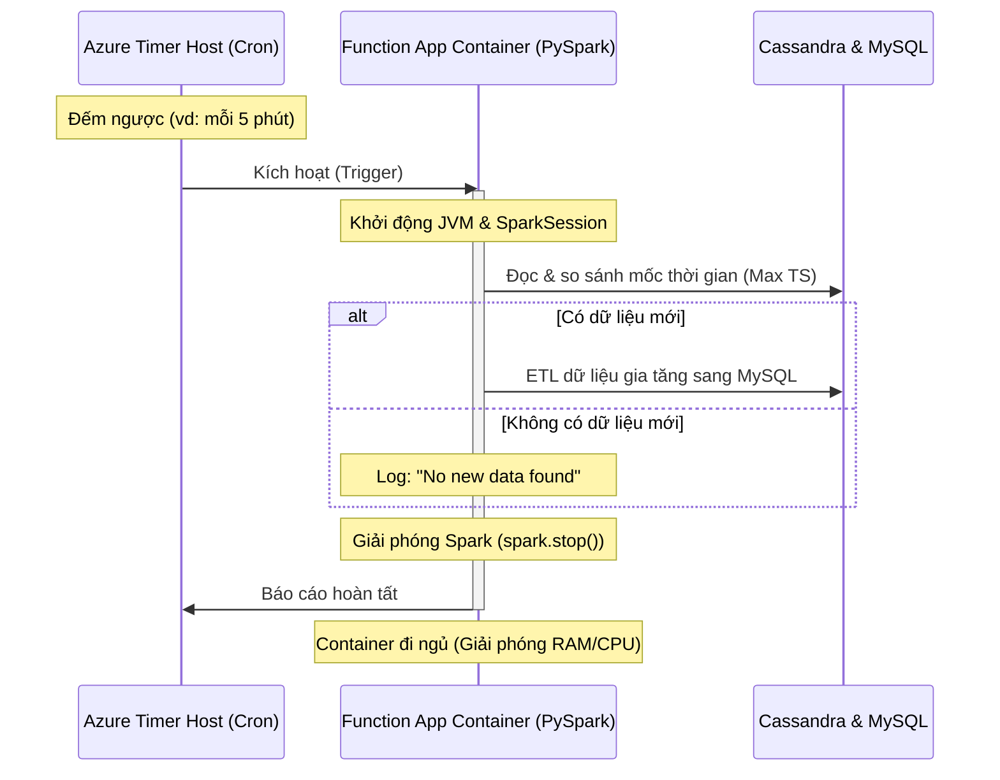

# Giải Thích Chi Tiết: Chuyển đổi ETL từ `while True` sang Azure Function App

Tài liệu này giải thích chi tiết các thay đổi trong mã nguồn **[etl_pipeline.py](file:///e:/DataEngineer/DE/Class4/Data_pipeline_for_recruitment_start_up/etl_pipeline.py)** để chuyển đổi luồng xử lý từ một kịch bản chạy vòng lặp vô hạn `while True` sang mô hình serverless **Azure Function App** kích hoạt bằng **Timer Trigger**.

---

## 🌟 GIỚI THIỆU KHÁI NIỆM CƠ BẢN

Trước khi đi sâu vào mã nguồn, chúng ta cần làm rõ hai khái niệm cốt lõi trong kiến trúc serverless của Azure: **Azure Function App** và **Timer Trigger**.

### 1. Azure Function App là gì?
**Azure Function App** là một dịch vụ tính toán phi máy chủ (Serverless Computing) cung cấp bởi Microsoft Azure. 
* **"Serverless" (Không máy chủ) không có nghĩa là không có máy chủ thực tế.** Trên thực tế, code của bạn vẫn chạy trên máy chủ vật lý của Microsoft. Nhưng từ góc độ của lập trình viên hoặc Data Engineer:
  * **Bạn được giải phóng hoàn toàn khỏi hạ tầng (No Infrastructure Management)**: Bạn không cần cài đặt hệ điều hành (Ubuntu, Windows Server), không cần cập nhật bản vá bảo mật, không cần cấu hình tường lửa (Firewall), và không cần cài sẵn môi trường Java, Python hay Spark lên máy chủ. Bạn chỉ việc viết code xử lý dữ liệu và tải nó lên. Cloud sẽ lo toàn bộ phần còn lại.
  * **Tự động mở rộng (Auto-scaling)**: Nếu bình thường hệ thống chỉ có vài click chuột, Azure sẽ chạy 1 instance cực kỳ nhỏ để xử lý. Nhưng nếu đột nhiên có hàng triệu click chuột ùa vào cùng một lúc, Azure sẽ tự động nhân bản code của bạn ra chạy song song trên 100 hay 1.000 máy chủ khác để gánh tải, rồi tự động thu hồi (scale-down) về 0 khi hết tải mà bạn không cần cấu hình bất kỳ dòng code nào.
  * **Ví dụ so sánh thực tế**: 
    * *Mô hình truyền thống (Virtual Machine)* giống như việc bạn **Thuê xe tự lái theo tháng**. Dù bạn đi nhiều, đi ít hay đỗ trong gara không đi, bạn vẫn phải trả nguyên tiền thuê xe hàng tháng, tự đổ xăng, tự mang xe đi bảo dưỡng, tự lo chỗ đỗ.
    * *Mô hình Serverless* giống như việc bạn **Đi Grab/Taxi**. Bạn chỉ trả tiền đúng cho quãng đường bạn di chuyển. Khi bạn xuống xe, bạn không cần quan tâm xe đó đỗ ở đâu, bảo dưỡng thế nào, xăng xe ra sao.
* **Hướng sự kiện (Event-driven)**: Đây là điểm khác biệt lớn nhất so với các ứng dụng truyền thống. Ứng dụng truyền thống cần chạy liên tục 24/7 để chờ việc. Còn Azure Function thì ngược lại: **Nó chỉ được đánh thức và khởi chạy khi có một "Sự kiện" (Trigger) xảy ra.** Sau khi xử lý xong sự kiện đó, nó sẽ tự động giải phóng tài nguyên và "đi ngủ".

### 2. Timer Trigger là gì?
**Timer Trigger** là một loại sự kiện kích hoạt dựa trên **thời gian biểu biểu định sẵn** (Sử dụng biểu thức Cron). 
* Thay vì chạy một vòng lặp vô hạn `while True` kết hợp với `time.sleep(5)` làm nghẽn CPU máy tính liên tục để kiểm tra xem có dữ liệu mới hay không, bạn sẽ giao nhiệm vụ lập lịch này cho hệ thống Azure.
* Đúng giờ (ví dụ: cứ mỗi 5 phút một lần), hệ thống Azure sẽ phát tín hiệu kích hoạt hàm Function App của bạn. Hàm thức dậy, kiểm tra Cassandra xem có bản ghi mới hay không, nếu có thì ETL sang MySQL, hoàn thành xong thì tự động tắt đi.

> [!NOTE]
> **💡 Câu hỏi thảo luận: Độ trễ 5 phút thì có còn là "Real-time" (Thời gian thực) không?**
>
> Câu trả lời là: **Không hoàn toàn là Real-time, mà chính xác là Near Real-time (Gần thời gian thực) hay Micro-batch.**
>
> Trong kỹ nghệ dữ liệu (Data Engineering), chúng ta phải luôn cân bằng giữa **Độ trễ (Latency)**, **Chi phí (Cost)** và **Hiệu năng hệ thống (Efficiency)**:
>
> 1. **True Real-time (Thời gian thực thực tế - Độ trễ mili-giây):**
>    * Dữ liệu đi tới đâu xử lý tới đó ngay lập tức (sử dụng Kafka + Flink/Spark Streaming).
>    * *Nhược điểm:* Yêu cầu hạ tầng chạy liên tục 24/7 (Cực kỳ tốn tiền điện toán đám mây). MySQL sẽ bị quá tải (RDBMS không chịu nổi hàng nghìn kết nối ghi nhỏ giọt liên tục mỗi giây do bị khóa bảng/khóa dòng liên tiếp).
>    * *Khi nào dùng:* Dành cho hệ thống phát hiện gian lận thẻ tín dụng, hệ thống lái xe tự động, hoặc các giao dịch chứng khoán.
>
> 2. **Near Real-time / Micro-batch (Độ trễ vài phút - Ví dụ: 5 phút):**
>    * Gom dữ liệu thành những gói nhỏ phát sinh trong 5 phút rồi xử lý gộp một lần.
>    * *Ưu điểm:* Tiết kiệm chi phí vượt trội (chỉ chạy serverless khi cần). Ghi dữ liệu vào MySQL cực kỳ hiệu quả bằng các truy vấn Bulk Insert gộp, bảo vệ database không bị nghẽn.
>    * *Thực tế doanh nghiệp:* Với một Startup tuyển dụng, người quản lý xem dashboard quảng cáo tuyển dụng (số lượt xem, lượt click) không cần cập nhật từng mili-giây. Việc số liệu click tăng sau mỗi 5 phút là đã **quá đủ nhanh** và mang lại trải nghiệm thời gian thực tuyệt vời cho họ.
>
> Do đó, mô hình Micro-batch 5 phút bằng Timer Trigger là giải pháp **tối ưu nhất về chi phí và tài nguyên** cho bài toán này.


#### Sơ đồ hoạt động của Timer Trigger:


### 3. So sánh mô hình chạy: Script Truyền Thống vs. Azure Function App

| Đặc điểm | Mô hình cũ (Script `while True`) | Mô hình mới (Azure Function App) |
| :--- | :--- | :--- |
| **Trạng thái chạy** | Chạy liên tục không ngừng (Daemon / Always-on) | Chạy ngắt quãng (On-demand), chỉ chạy khi đến giờ |
| **Tiêu tốn CPU** | CPU luôn ở trạng thái bị chiếm dụng bởi luồng `sleep` | 0% CPU lúc rảnh, chỉ dùng CPU trong vài giây khi xử lý |
| **Quản lý RAM** | Spark Session giữ kết nối RAM liên tục, dễ bị Memory Leak | Khởi tạo Spark khi chạy và xóa sạch (`spark.stop()`) khi xong |
| **Khả năng tự phục hồi** | Nếu script gặp lỗi nghiêm trọng (crash), chương trình sẽ tắt hẳn | Nếu một lượt chạy bị crash, lượt chạy sau (5 phút nữa) vẫn tự động kích hoạt bình thường |
| **Chi phí Cloud** | Tính tiền 24/7 theo thời gian bật máy ảo (VM) | Chỉ tính tiền dựa trên số giây thực tế mà hàm chạy |

### 4. Tại sao chạy Local nhưng lại nhắc đến "Cloud"? Hướng đi của dự án này

Nhiều bạn sẽ thắc mắc: *"Tại sao hướng dẫn chạy Local miễn phí nhưng trong tài liệu lại liên tục nhắc tới Cloud (Azure, Serverless)?"*

Dưới đây là câu trả lời cặn kẽ để bạn nắm rõ hướng đi và bản chất kiến trúc của dự án này:

#### A. Bản chất của Azure Functions
* **Azure Functions** là công nghệ gốc được Microsoft viết để chạy trên Cloud Azure.
* Tuy nhiên, để hỗ trợ lập trình viên phát triển ứng dụng thuận tiện và **hoàn toàn miễn phí**, Microsoft cung cấp trình giả lập chạy dưới máy local (thông qua Docker hoặc công cụ Azure Functions Core Tools). 
* Trình giả lập này bắt chước **100% cơ chế chạy trên Cloud**, nhưng chạy bằng phần cứng máy tính của bạn và sử dụng các container giả lập (như **Azurite**) thay vì dịch vụ lưu trữ Azure Storage thực tế.

#### B. Hướng đi dự án đang áp dụng cho bạn
Chúng ta đang **đóng gói (Containerize) toàn bộ môi trường giả lập đó vào trong Docker** trên máy cá nhân của bạn:

```text
[ Máy tính cá nhân của bạn (Local) ]
      │
      └───► Chạy Docker Compose
                 │
                 ├──► container MySQL (Database đích nhận kết quả)
                 ├──► container Cassandra (Database nguồn chứa log thô)
                 ├──► container Azurite (Giả lập Cloud Storage để chạy Timer Trigger)
                 └──► container ETL Function App (Chạy code PySpark của bạn + Java JRE)
```

* **Tại sao cần Azurite?** Timer Trigger cần một nơi để ghi nhận lịch trình lịch sử chạy (hàm đã chạy lúc mấy giờ, có bị trễ không). Container `azurite` đóng vai trò "giả lập kho chứa" này dưới local để Function App của bạn hoạt động ngon lành mà không cần kết nối mạng hay liên kết thẻ tín dụng Azure.
* **Tại sao cần Dockerfile?** PySpark yêu cầu có Java JRE mới chạy được. Thay vì cài thủ công Java lên Windows rất dễ lỗi đường dẫn `JAVA_HOME`, Dockerfile sẽ tự cài sẵn Java và Spark vào container `etl-function-app`. Bạn chỉ cần gõ đúng 1 lệnh để khởi động toàn bộ.

#### C. Lợi ích lớn nhất của hướng đi này
1. **Học tập chuẩn hóa (Industry Standard):** Bạn học được cách phát triển Serverless Function và đóng gói Docker đúng chuẩn chuyên nghiệp trong các dự án thực tế.
2. **"Viết một lần, chạy mọi nơi" (Code Once, Run Anywhere):** Toàn bộ code xử lý trong [etl_pipeline.py](file:///e:/DataEngineer/DE/Class4/Data_pipeline_for_recruitment_start_up/etl_pipeline.py) hiện tại là chuẩn Cloud. Nếu sau này bạn hoặc công ty muốn chuyển lên đám mây thật (Azure), bạn **giữ nguyên 100% mã nguồn**, chỉ cần đổi địa chỉ kết nối Database (IP/Host) trong cấu hình là hệ thống tự động chạy trên Cloud mà không cần sửa đổi thêm bất kỳ dòng code nào.

---

## 1. Import Thư viện & Khởi tạo Function App

### Mã nguồn hiện tại:
```python
import os
import sys
import logging
import datetime
from uuid import UUID
import azure.functions as func
from pyspark.sql import SparkSession
from pyspark.sql.functions import col, lit, udf, coalesce, round, avg, sum, count
from pyspark.sql.types import StringType

# Khởi tạo Azure Function App
app = func.FunctionApp()
```

### Giải thích thay đổi:
* **Thêm thư viện `azure.functions`**: Dùng để sử dụng các tính năng đặc thù của Azure Functions (ví dụ như Timer Trigger, kiểu dữ liệu `func.TimerRequest`).
* **Thêm thư viện `logging`**: Thay vì in log ra console bằng `print(...)` như script cũ, Function App sử dụng thư viện logging chuẩn của Python để lưu vết logs lên đám mây (Application Insights) hoặc container log của Docker.
* **Khởi tạo đối tượng `app = func.FunctionApp()`**: Đây là điểm bắt đầu (entry point) để khai báo các Functions chạy trong project theo mô hình lập trình Python v2 mới nhất của Microsoft.

---

## 2. Quản lý cấu hình bằng Biến Môi Trường (Environment Variables)

### Mã nguồn hiện tại:
```python
CASSANDRA_HOST = os.environ.get("CASSANDRA_HOST", "127.0.0.1")
CASSANDRA_PORT = os.environ.get("CASSANDRA_PORT", "9042")
CASSANDRA_USER = os.environ.get("CASSANDRA_USER", "cassandra")
CASSANDRA_PASSWORD = os.environ.get("CASSANDRA_PASSWORD", "cassandra")
CASSANDRA_KEYSPACE = os.environ.get("CASSANDRA_KEYSPACE", "recruitment")
CASSANDRA_TABLE = os.environ.get("CASSANDRA_TABLE", "tracking")

MYSQL_HOST = os.environ.get("MYSQL_HOST", "127.0.0.1")
MYSQL_PORT = os.environ.get("MYSQL_PORT", "3306")
MYSQL_USER = os.environ.get("MYSQL_USER", "root")
MYSQL_PASSWORD = os.environ.get("MYSQL_PASSWORD", "123")
MYSQL_DATABASE = os.environ.get("MYSQL_DATABASE", "etl_database")
MYSQL_TARGET_TABLE = os.environ.get("MYSQL_TARGET_TABLE", "events")
```

### Giải thích thay đổi:
* **Từ "Hardcode" sang "Dynamic Configuration"**: Trong script cũ, cấu hình database được viết cứng (ví dụ: `MYSQL_PASSWORD = "123"`). 
* Trong Function App, chúng ta sử dụng `os.environ.get("TÊN_BIẾN", "Giá trị mặc định")`. 
  * Khi chạy local, các cấu hình này sẽ tự động đọc từ file `local.settings.json`.
  * Khi đưa lên Cloud, chúng ta có thể cấu hình chúng thông qua màn hình App Settings của Azure Portal mà không cần sửa đổi mã nguồn.

---

## 3. Khởi tạo & Quản lý vòng đời Spark Session

### Mã nguồn hiện tại:
```python
def create_spark_session():
    """Khởi tạo SparkSession cục bộ cho lượt chạy hiện tại"""
    spark = SparkSession.builder \
        .appName("AzureFunction-ETL") \
        .config("spark.jars.packages", "com.datastax.spark:spark-cassandra-connector_2.12:3.5.1,com.mysql:mysql-connector-j:8.3.0") \
        .config("spark.cassandra.connection.host", CASSANDRA_HOST) \
        .config("spark.cassandra.connection.port", CASSANDRA_PORT) \
        .config("spark.cassandra.auth.username", CASSANDRA_USER) \
        .config("spark.cassandra.auth.password", CASSANDRA_PASSWORD) \
        .getOrCreate()
    
    spark.sparkContext.setLogLevel("WARN")
    return spark
```

### Giải thích thay đổi:
* **Loại bỏ Spark Session toàn cục (Global Variable)**: 
  * Ở bản script cũ, Spark Session được tạo một lần ở đầu file `spark = create_spark_session()` và chạy vô thời hạn. 
  * Trong Function App, chúng ta loại bỏ dòng này ở phạm vi toàn cục. Thay vào đó, Spark sẽ chỉ được tạo khi hàm Timer Trigger kích hoạt. Khi hàm chạy xong, ta đóng nó bằng `spark.stop()`.
  * Việc này ngăn ngừa lỗi "rò rỉ bộ nhớ" (memory leak) vì JVM Java của Spark sẽ được dọn dẹp sạch sẽ sau mỗi chu kỳ chạy, giúp Function App hoạt động ổn định và tiết kiệm tài nguyên Serverless.

---

## 4. Truyền tham số `spark` vào các hàm xử lý dữ liệu

### Mã nguồn hiện tại (Ví dụ hàm clicks):
```python
def calculating_clicks(spark, df):
    clicks_data = df.filter(df.custom_track == 'click')
    clicks_data = clicks_data.na.fill({
        'bid': 0.0, 'job_id': 0, 'publisher_id': 0, 'group_id': 0, 'campaign_id': 0
    })
    clicks_data.createOrReplaceTempView("clicks")
    
    return spark.sql("""
        SELECT 
            job_id, DATE(ts) AS date, HOUR(ts) AS hour, publisher_id, campaign_id, group_id, 
            ROUND(AVG(bid), 2) AS bid_set, COUNT(*) AS clicks, ROUND(SUM(bid), 2) AS spend_hour 
        FROM clicks
        GROUP BY job_id, DATE(ts), HOUR(ts), publisher_id, campaign_id, group_id
    """)
```

### Giải thích thay đổi:
* **Cô lập luồng dữ liệu (Dependency Injection)**: Do không còn biến `spark` ở phạm vi toàn cục (global scope), tất cả các hàm con cần tương tác với cơ sở dữ liệu hoặc sử dụng Spark SQL như `calculating_clicks`, `calculating_conversion`, `retrieve_company_data`, `get_latest_time_cassandra`... hiện tại đều yêu cầu nhận biến `spark` làm tham số đầu vào thứ nhất.
* **Thay thế hàm cũ**: Thay thế `registerTempTable` (đã lỗi thời và bị gỡ bỏ ở các bản Spark mới) bằng `createOrReplaceTempView` để lưu view tạm an toàn hơn.

---

## 5. Điểm kích hoạt chính: Loại bỏ `while True` chuyển sang `Timer Trigger`

### Mã nguồn hiện tại:
```python
# Cấu hình cron chạy định kỳ mỗi 5 phút: "0 */5 * * * *"
@app.schedule(schedule="0 */5 * * * *", arg_name="timer", run_on_startup=True, use_monitor=False)
def timer_trigger_etl(timer: func.TimerRequest) -> None:
    utc_timestamp = datetime.datetime.utcnow().replace(
        tzinfo=datetime.timezone.utc).isoformat()

    if timer.past_due:
        logging.warning('Timer bị trễ so với lịch trình!')

    logging.info(f'Function khởi động tại thời điểm UTC: {utc_timestamp}')
    
    # Khởi tạo Spark Session cho phiên làm việc này
    spark = create_spark_session()
    
    try:
        cassandra_time = get_latest_time_cassandra(spark)
        logging.info(f'Mốc thời gian mới nhất trên Cassandra: {cassandra_time}')
        
        mysql_time = get_mysql_latest_time(spark)
        logging.info(f'Mốc thời gian đã đồng bộ gần nhất trên MySQL: {mysql_time}')
        
        if cassandra_time and (mysql_time is None or cassandra_time > mysql_time): 
            logging.info(">>> Phát hiện dữ liệu mới! Kích hoạt Main ETL Task...")
            main_task(spark, mysql_time)
            logging.info(">>> Đồng bộ dữ liệu ETL thành công!")
        else:
            logging.info("Không phát hiện dữ liệu mới. Bỏ qua lượt chạy này.")
            
    except Exception as e:
        logging.error(f"ETL Execution Failed: {str(e)}")
        
    finally:
        # Giải phóng Spark để trả lại tài nguyên CPU/RAM của serverless container
        spark.stop()
        logging.info("Spark session đã dừng an toàn.")
```

### Giải thích thay đổi:
* **Decorator `@app.schedule`**: Đây là linh hồn của Function App. Nó khai báo cho host biết hàm `timer_trigger_etl` này sẽ tự động được chạy mà không cần vòng lặp `while True`.
  * `schedule="0 */5 * * * *"`: Định nghĩa lịch trình chạy bằng cấu pháp Cron (chạy vào giây thứ 0 của mỗi 5 phút).
  * `run_on_startup=True`: Yêu cầu hàm chạy ngay lập tức khi ứng dụng khởi động lần đầu tiên (rất tiện để debug kiểm tra kết quả ngay lập tức thay vì phải đợi 5 phút).
* **Quản lý lỗi và dọn dẹp tài nguyên**:
  * Toàn bộ mã nguồn chạy được bao bọc bởi khối `try...except...finally`.
  * Khối `finally` đảm bảo dù quá trình xử lý ETL thành công hay thất bại (gặp lỗi), lệnh `spark.stop()` **vẫn luôn luôn được thực thi** để tắt JVM của Spark và giải phóng hoàn toàn bộ nhớ RAM.

---

## 🛠️ HƯỚNG DẪN CHẠY PIPELINE TRÊN LOCAL DOCKER

Để chạy thử nghiệm toàn bộ hệ thống ETL dưới dạng Azure Function App giả lập này trên máy tính của bạn hoàn toàn miễn phí, hãy làm theo các bước đơn giản sau:

### Bước 1: Chuẩn bị các file trong thư mục dự án
Đảm bảo thư mục dự án của bạn có đủ các file sau:
1. **[etl_pipeline.py](file:///e:/DataEngineer/DE/Class4/Data_pipeline_for_recruitment_start_up/etl_pipeline.py)**: Chứa mã nguồn Python của Function App.
2. **[Dockerfile](file:///e:/DataEngineer/DE/Class4/Data_pipeline_for_recruitment_start_up/Dockerfile)**: Dùng để build môi trường có Java JDK để chạy PySpark.
3. **[requirements.txt](file:///e:/DataEngineer/DE/Class4/Data_pipeline_for_recruitment_start_up/requirements.txt)**: Khai báo thư viện Python cần dùng.
4. **[host.json](file:///e:/DataEngineer/DE/Class4/Data_pipeline_for_recruitment_start_up/host.json)** & **[local.settings.json](file:///e:/DataEngineer/DE/Class4/Data_pipeline_for_recruitment_start_up/local.settings.json)**: Các file cấu hình hệ thống của Azure.
5. **[docker-compose.yml](file:///e:/DataEngineer/DE/Class4/Data_pipeline_for_recruitment_start_up/docker-compose.yml)**: Quản lý cụm database (MySQL, Cassandra), Grafana, Azurite và Function App.

### Bước 2: Kích hoạt ứng dụng
Mở Terminal hoặc Command Prompt tại thư mục dự án và chạy duy nhất lệnh sau để tự động tải, build và khởi động toàn bộ hệ thống:
```bash
docker compose up --build
```

### Bước 3: Quan sát logs hoạt động
Khi chạy lệnh trên, bạn hãy theo dõi màn hình Terminal. Bạn sẽ thấy các log của `etl_function_app` hiển thị tuần tự như sau:
1. **Đăng ký Trigger thành công**: 
   `Job 'timer_trigger_etl' loaded. Next execution: ...`
2. **Khởi động chạy thử lần đầu (do `run_on_startup=True`)**:
   `Function khởi động tại thời điểm UTC: ...`
3. **Kết nối Cassandra và MySQL để kiểm tra dữ liệu**:
   `Mốc thời gian mới nhất trên Cassandra: 2026-06-20 ...`
   `Mốc thời gian đã đồng bộ gần nhất trên MySQL: ...`
4. **ETL dữ liệu**: Nếu phát hiện Cassandra có log mới hơn mốc MySQL, log sẽ in ra:
   `>>> Phát hiện dữ liệu mới! Kích hoạt Main ETL Task...`
   `Data imported successfully`
   `>>> Đồng bộ dữ liệu ETL thành công!`
5. **Giải phóng RAM**: Sau khi kết thúc chuỗi xử lý:
   `Spark session đã dừng an toàn.`

### Bước 4: Tắt hệ thống sau khi học xong
Khi bạn muốn kết thúc học bài và tắt hệ thống để máy tính nhẹ lại bình thường:
* Nhấn `Ctrl + C` trên Terminal để tạm dừng.
* Chạy lệnh sau để dọn dẹp sạch sẽ các container và giải phóng RAM/ổ cứng:
  ```bash
  docker compose down
  ```